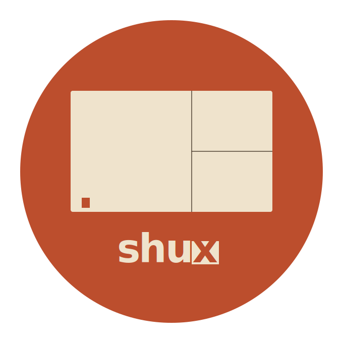

<p align="center">
  
</p>

<p align="center">
  <strong>The terminal multiplexer built for AI coding agents</strong><br>
  <em>Typed API. Deterministic state. Zero wrappers needed.</em><br>
  
  
</p>

---

## Why shux

Every AI agent orchestration tool today wraps tmux. They do it because no
multiplexer offers a typed API for programmatic control. shux is what tmux
would be if designed today: humans and agents are equal citizens, every
operation is available through both keyboard and JSON-RPC, state is always
queryable, deterministic, and streamable.

```bash
# As a human
shux                            # attach to last session, or create "default"

# As an agent
shux api session.list '{}'      # typed, JSON, no screen scraping
shux pane run -s dev cargo test # idempotent; ensure semantics; safe to retry
```

## Install

The fastest path — pre-built binary for macOS and Linux (x86_64 / aarch64),
verified by SHA-256 and dropped into `~/.local/bin`:

```bash
curl -sSfL https://raw.githubusercontent.com/indrasvat/shux/main/install.sh | bash
```

Pin a version or change the install dir:

```bash
curl -sSfL https://raw.githubusercontent.com/indrasvat/shux/main/install.sh \
  | bash -s -- --version v0.1.0 --dir ~/.bin
```

Or build from source:

```bash
git clone https://github.com/indrasvat/shux.git
cd shux
make install   # → ~/.local/bin/shux
```

Requires Rust 1.93+ and a Unix-like OS (macOS, Linux). For dev setup, see
[`docs/development.md`](docs/development.md).

## Quickstart

```bash
shux                    # opens a session, attaches the TUI
shux new -s work        # create a named session
shux pane split -s work # split the active pane
shux config init        # scaffold ~/.config/shux/config.toml
```

Inside the TUI, the prefix key is `Ctrl+Space` by default:

| Key | Action |
|---|---|
| `Ctrl+Space \|`/`-` | split vertical / horizontal |
| `Ctrl+Space h`/`j`/`k`/`l` | focus left / down / up / right |
| `Ctrl+Space z` | toggle zoom |
| `Ctrl+Space d` | detach |
| click any pane | focus it |
| drag a border | resize |

## Documentation

Read in this order:

1. [**Quickstart for humans**](docs/users.md) — keybindings, status bar,
   customization, dotfile integration
2. [**Quickstart for agents**](docs/agents.md) — typed JSON-RPC surface,
   `ensure` semantics, event streaming, scripting patterns
3. [**Configuration**](docs/configuration.md) — `~/.config/shux/config.toml`
   schema, hot reload, status-bar segments, starship integration
4. [**Architecture**](docs/architecture.md) — daemon model, the seven crates,
   why each one exists, the patterns that hold it all together
5. [**Development**](docs/development.md) — dev setup, make targets, the L1–L4
   testing strategy
6. [**Roadmap**](docs/roadmap.md) — what's done, what's next, milestone plan
7. [**Full PRD**](docs/PRD.md) — design philosophy, competitive analysis,
   plugin WIT interfaces, performance budgets

## License

MIT
